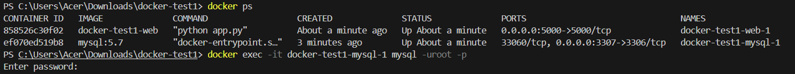

# Setting up Docker with MySQL
## Build the Docker Containers
```bash

docker-compose build
```
```bash
Start the Docker Containers
```bash
 
docker-compose up
```
## Accessing the Application
### Navigate to:

## http://127.0.0.1:5000/ or http://localhost:5000/


## Setting Up MySQL Workbench

### Open MySQL Workbench and Create a New Connection:

**Hostname: 127.0.0.1**

**Port: 3307**

**Username: root**

**Check "Store in Vault" for password storage**

**Password: example**

**Troubleshooting MySQL Connection:**

## If you encounter connection errors:


**Open a new terminal in the project directory**

### Execute the following commands:

```bash
docker ps
```


```bash
docker exec -it <mysql_container_name_or_id> mysql -uroot -p
```
###  Enter password when prompted.

## THEN EXCECUTE THIS 
```bash

SHOW DATABASES;
```
```bash
USE userdb;
CREATE TABLE users (
    id INT AUTO_INCREMENT PRIMARY KEY,
    name VARCHAR(100) NOT NULL,
    age INT NOT NULL,
    phone VARCHAR(20) NOT NULL,
    email VARCHAR(100) NOT NULL
);

```

# Restarting the Docker Containers:

## After setting up the database schema, restart the containers to apply changes.